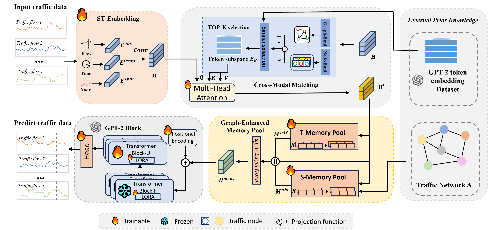

# STM-LLM: Semantic Alignment and Traffic Memory Enhanced Large Language Model for Traffic Prediction

This repository provides the PyTorch implementation of **STM-LLM**, a spatio-temporal large language model for traffic prediction that improves semantic alignment between traffic signals and language representations while enhancing long-range traffic dependency modeling with graph-aware memory.

This project builds on prior open-source work and extends it with a new semantic matching and graph-enhanced memory design. In particular, we sincerely thank the authors of the original **ST-LLM** repository for releasing their codebase, which provided an important foundation for our implementation and experimentation.


## Overview

Urban traffic forecasting requires jointly modeling temporal patterns and spatial dependencies over graph-structured traffic data. Although large language models have recently shown strong potential for time-series forecasting, directly adapting them to traffic prediction remains challenging. In particular, numerical traffic signals are not naturally aligned with the semantic space of pretrained language models, and existing methods often struggle to capture long-range and structured dependencies across traffic nodes.

To address these challenges, **STM-LLM** introduces a dynamic **Top-K cross-modal matching module** for traffic-aware semantic alignment, a **graph-enhanced spatio-temporal memory pool** for modeling node-level and neighborhood-level patterns, and a **partially frozen GPT-2 backbone with LoRA adaptation** for efficient training and robust forecasting.

## Key Features

* Traffic-aware semantic alignment through Top-K token filtering
* Graph-enhanced memory retrieval for spatial-temporal dependency modeling
* Parameter-efficient adaptation with LoRA
* Support for multi-step traffic forecasting on graph-structured urban mobility datasets
* Strong performance in standard, few-shot, and zero-shot settings

## Dependencies

* Python 3.8.19
* PyTorch 2.4.1
* CUDA 11.7
* torchvision 0.19.1

Create the environment with:

```bash
conda env create -f env_ubuntu.yaml
```

## Datasets

The datasets used in this project follow the same data resources provided by **ST-LLM+**:

* Dataset source: [ST-LLM+ GitHub Repository](https://github.com/kethmih/ST-LLM-Plus)
* Please refer to the dataset instructions and linked resources in the ST-LLM+/ST-LLM project page for preprocessing and usage details.

Typical datasets used in this project include:

* **NYCTaxi**
* **CHBike**

## Checkpoints

Pretrained checkpoints are available here:

* Checkpoints: [Google Drive Folder](https://drive.google.com/drive/folders/1k4h67QwhUaFrIZrHNxWq-YJRsMqNFkN9?usp=sharing)

## Training

Example training command:

```bash
CUDA_VISIBLE_DEVICES=0 nohup python train_STM_LLM.py --data bike_pick > your_log_name.log &
```

You can switch datasets by changing the `--data` argument, for example:

* `bike_pick`
* `taxi_pick`

## Citation

If you find this repository useful in your research, please consider starring the repository and citing the related work.

### STM-LLM

```bibtex
@article{stmllm2025,
  title={STM-LLM: Semantic Alignment and Traffic Memory Enhanced Large Language Model for Traffic Prediction},
  author={},
  journal={},
  year={2025}
}
```

  
## Acknowledgements

We gratefully acknowledge the following open-source projects and prior work:

* **ST-LLM+**: Our implementation is substantially inspired by and partially built upon the training framework and design ideas released by the original ST-LLM authors. We sincerely thank them for making their code publicly available and for supporting reproducible research in LLM-based traffic forecasting.
* **ESG**: We also thank the ESG project for providing data processing resources and references for the traffic datasets used in this line of work.
* More broadly, we appreciate the open-source community for contributing tools, libraries, and benchmarks that make this research possible.

If you use this repository, we encourage you to also cite and acknowledge the original ST-LLM+ work alongside this project.
### ST-LLM+

```bibtex
@ARTICLE{11005661,
  author={Liu, Chenxi and Hettige, Kethmi Hirushini and Xu, Qianxiong and Long, Cheng and Xiang, Shili and Cong, Gao and Li, Ziyue and Zhao, Rui},
  journal={IEEE Transactions on Knowledge and Data Engineering},
  title={ST-LLM+: Graph Enhanced Spatio-Temporal Large Language Models for Traffic Prediction},
  year={2025},
  volume={37},
  number={8},
  pages={4846-4859},
  doi={10.1109/TKDE.2025.3570705}
}
```

### Original ST-LLM

```bibtex
@inproceedings{liu2024spatial,
  title={Spatial-Temporal Large Language Model for Traffic Prediction},
  author={Liu, Chenxi and Yang, Sun and Xu, Qianxiong and Li, Zhishuai and Long, Cheng and Li, Ziyue and Zhao, Rui},
  booktitle={MDM},
  year={2024}
}
```


## Contact

For questions or collaboration, please open an issue or contact the project maintainers.
